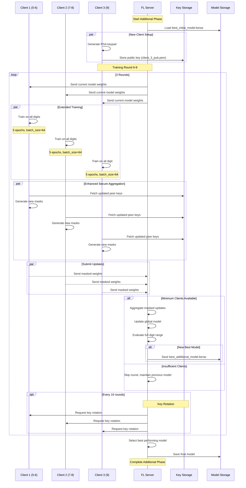

```mermaid
sequenceDiagram
    participant C1 as Client 1 (5-6)
    participant C2 as Client 2 (7-8)
    participant C3 as Client 3 (9)
    participant S as FL Server
    participant KS as Key Storage
    participant MS as Model Storage

    Note over S: Start Additional Phase
    S->>MS: Load best_initial_model.keras
    
    par New Client Setup
        C3->>C3: Generate RSA keypair
        C3->>KS: Store public key (client_3_pub.pem)
    end

    Note over S,C3: Training Round 6-8
    loop 3 Rounds
        S->>C1: Send current model weights
        S->>C2: Send current model weights
        S->>C3: Send current model weights
        
        par Extended Training
            C1->>C1: Train on all digits
            Note over C1: 5 epochs, batch_size=64
            C2->>C2: Train on all digits
            Note over C2: 5 epochs, batch_size=64
            C3->>C3: Train on all digit
            Note over C3: 5 epochs, batch_size=64
        end

        par Enhanced Secure Aggregation
            C1->>KS: Fetch updated peer keys
            C1->>C1: Generate new masks
            C2->>KS: Fetch updated peer keys
            C2->>C2: Generate new masks
            C3->>KS: Fetch updated peer keys
            C3->>C3: Generate new masks
        end

        par Submit Updates
            C1-->>S: Send masked weights
            C2-->>S: Send masked weights
            C3-->>S: Send masked weights
        end

        alt Minimum Clients Available
            S->>S: Aggregate masked updates
            S->>S: Update global model
            S->>S: Evaluate full digit range
            alt New Best Model
                S->>MS: Save best_additional_model.keras
            end
        else Insufficient Clients
            S->>S: Skip round, maintain previous model
        end

        opt Every 10 rounds
            Note over S,KS: Key Rotation
            S->>C1: Request key rotation
            S->>C2: Request key rotation
            S->>C3: Request key rotation
        end
    end

    S->>S: Select best performing model
    S->>MS: Save final model
    Note over S: Complete Additional Phase
```
