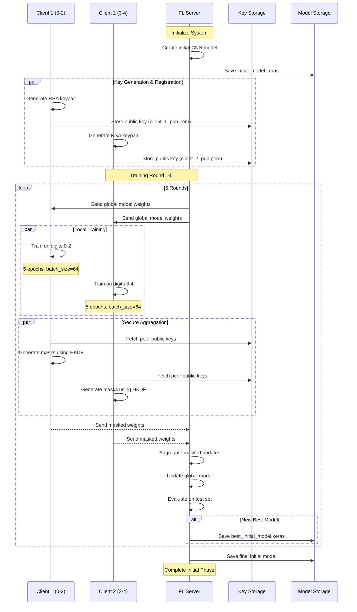

```mermaid
sequenceDiagram
    participant C1 as Client 1 (0-2)
    participant C2 as Client 2 (3-4)
    participant S as FL Server
    participant KS as Key Storage
    participant MS as Model Storage

    Note over S: Initialize System
    S->>S: Create initial CNN model
    S->>MS: Save initial_model.keras
    
    par Key Generation & Registration
        C1->>C1: Generate RSA keypair
        C1->>KS: Store public key (client_1_pub.pem)
        C2->>C2: Generate RSA keypair
        C2->>KS: Store public key (client_2_pub.pem)
    end

    Note over S,C2: Training Round 1-5
    loop 5 Rounds
        S->>C1: Send global model weights
        S->>C2: Send global model weights
        
        par Local Training
            C1->>C1: Train on digits 0-2
            Note over C1: 5 epochs, batch_size=64
            C2->>C2: Train on digits 3-4 
            Note over C2: 5 epochs, batch_size=64
        end

        par Secure Aggregation
            C1->>KS: Fetch peer public keys
            C1->>C1: Generate masks using HKDF
            C2->>KS: Fetch peer public keys
            C2->>C2: Generate masks using HKDF
        end

        C1-->>S: Send masked weights
        C2-->>S: Send masked weights

        S->>S: Aggregate masked updates
        S->>S: Update global model
        S->>S: Evaluate on test set
        alt New Best Model
            S->>MS: Save best_initial_model.keras
        end
    end

    S->>MS: Save final initial model
    Note over S: Complete Initial Phase
```
