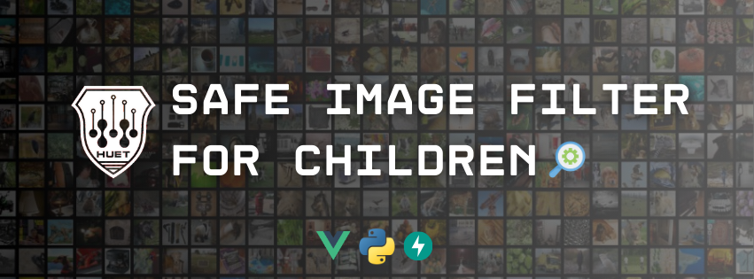

## Safe Image Filter for Children

- **Created by**: Tranlybuu & Levantan & Tranvantuanphong
- **Coding version**: Python 3.9.0

## Document

Google Drive: https://drive.google.com/drive/folders/1uRgeFbavkb3-EC2bPfs2t5oqr-a9aPhJ?usp=sharing

### Requirement

- **Install Python**: `Python 3.9.0`

- **Install primary libraries**: ```pip install -r requirements.txt```

### Project's Dir
    .
    ├── docs/                    # Documentation files
    ├── model/                   # Training Model (for development)
    ├── database/                # Input videos to train (for development)
    ├── frontend/                # Application's interface - Website (for production)
    ├── mobile/                  # Application's interface - Mobile App (for production)
    ├── backend/                 # AI Model -> API (for production)
    ├── docker/                  # Build and deploy app (for production)
    ├── requirements.txt
    ├── LICENSE
    └── README.md

