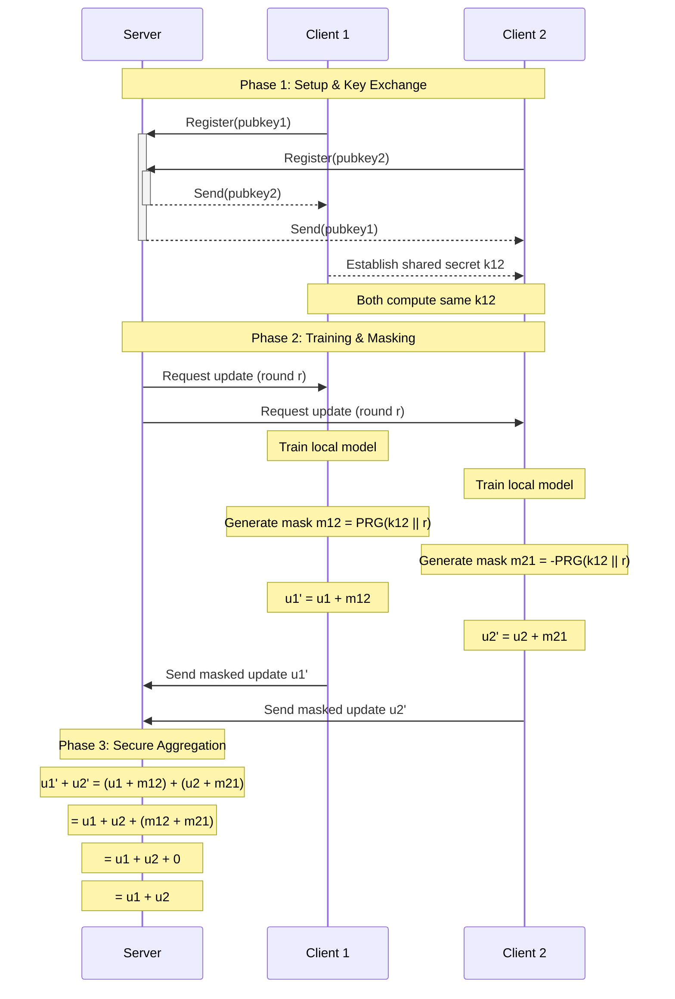

# Secure Aggregation trong Federated Learning

## 1. Tổng Quan

Secure Aggregation là một kỹ thuật cryptographic cho phép server tổng hợp các model updates từ clients mà không thấy được giá trị cụ thể của từng update. Kỹ thuật này đảm bảo tính riêng tư của dữ liệu training từng client trong khi vẫn cho phép học tập liên kết hiệu quả.

## 2. Các Thành Phần Chính

### 2.1 Mục Tiêu Bảo Mật
- Server chỉ thấy được tổng của các updates
- Clients không thấy updates của nhau
- Bảo vệ privacy ngay cả khi có dropouts
- Chống lại các tấn công man-in-the-middle

### 2.2 Cơ Chế Hoạt Động
1. **Key Exchange**: Thiết lập shared keys giữa các clients
2. **Masking**: Clients che dấu updates bằng masks 
3. **Aggregation**: Server tổng hợp masked updates
4. **Unmasking**: Masks tự triệt tiêu trong quá trình tổng hợp

## 3. Chi Tiết Protocol

### 3.1 Setup Phase
1. Mỗi client tạo public-private key pair
2. Clients trao đổi public keys thông qua server
3. Mỗi cặp clients thiết lập shared secret

### 3.2 Training Phase
1. Clients train local models
2. Tạo masks dựa trên shared secrets
3. Apply masks vào model updates
4. Gửi masked updates cho server

### 3.3 Aggregation Phase
1. Server nhận masked updates
2. Thực hiện weighted averaging
3. Masks tự triệt tiêu trong quá trình tổng hợp
4. Server cập nhật global model

## 4. Protocol Flow

## 5. Chi Tiết Triển Khai 

### 5.1 Key Generation & Exchange
```python
# Client tạo keypair
private_key, public_key = CryptoUtils.generate_keypair()

# Clients trao đổi public keys qua server
peer_pubkeys = config.get('peer_pubkeys', {})
```

### 5.2 Mask Generation
```python
# Generate deterministic mask từ shared key
def generate_mask(shared_key, round_id, shape):
    seed = HKDF(shared_key, round_id) 
    rng = np.random.RandomState(seed)
    return rng.normal(0, 0.1, size=shape)
```

### 5.3 Update Masking
```python
# Client apply mask vào update
masked_update = update + total_mask

# Server tổng hợp masked updates
aggregated = sum(masked_updates) / len(clients)
```

## 6. Xử Lý Dropout

### 6.1 Phát Hiện Dropout
- Monitor số lượng clients active
- Tính dropout rate mỗi round
- So sánh với ngưỡng cấu hình

### 6.2 Recovery Strategy
```python
dropout_rate = 1 - (len(active_clients) / total_clients)
if dropout_rate > SECURE_AGG_CONFIG['dropout_threshold']:
    if SECURE_AGG_CONFIG['enable_dropout_recovery']:
        # Thực hiện recovery
        pass
    else:
        # Abort round
        return None
```

## 7. Các Tính Năng Bảo Mật

### 7.1 Key Rotation
- Rotate keys định kỳ để tăng security
- Configurable rotation frequency
- Synchronized rotation giữa clients

### 7.2 Threshold Security
- Yêu cầu số lượng clients tối thiểu
- Validate trước khi unmasking
- Prevent information leakage

## 8. Optimizations

### 8.1 Communication
- Batch key exchange
- Compress masked updates
- Efficient mask serialization

### 8.2 Computation  
- Parallel mask generation
- Optimized cryptographic operations
- Cache frequently used values